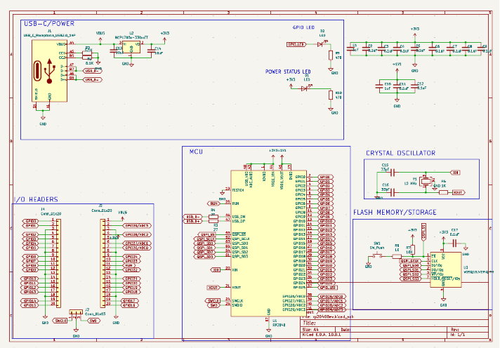
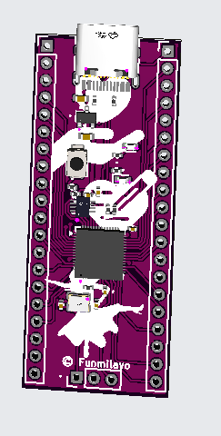

This journal goes progressively!!

I followed the tutorial to build the schematic. Ambitious me thought to add a LiPo battery to it >> also so I can get to understand it now for when I make my watch (coming soon, I hope).

To (understand how to) add it, I asked chatGPT, looked through about 4 YT videos, and did a lot of Google search.

I connected the MCP73831 as the charging protector thing and the MCP1700 as the regulator.

I also added a **status LED** (not charging STATUS, the board status)

My schematic is FULLL!
1st pic: zooming in on power part
2nd pic: entire schematic.

I dipped the entire LPO thing cuz I found out the LDO I was gonna use was the same as the LDO that the tutorial later changed to. 

I added two LED's, one for power and another as inbuilt to a GPIO!

Here's my current schematic

I spent at least 2 weeks :(( for just trying to route the differential pair, like lowkk!!

When I finally finished

### I redid my pcb routing 3 good times (as in created a new project every single time)

In the last time, I put most of my capacitors at the back, just cuz of lack of space!!

But I did it all at the end!! Hoorayyy!!

I added svg files from https://svgrepo.com, you can find them all in the repo!

Spent the entire night and following morning choosing pcb parts. some were showing up as unavailable till I searched up parts on the website!!

And my final pcb is done!! Yipeee!
